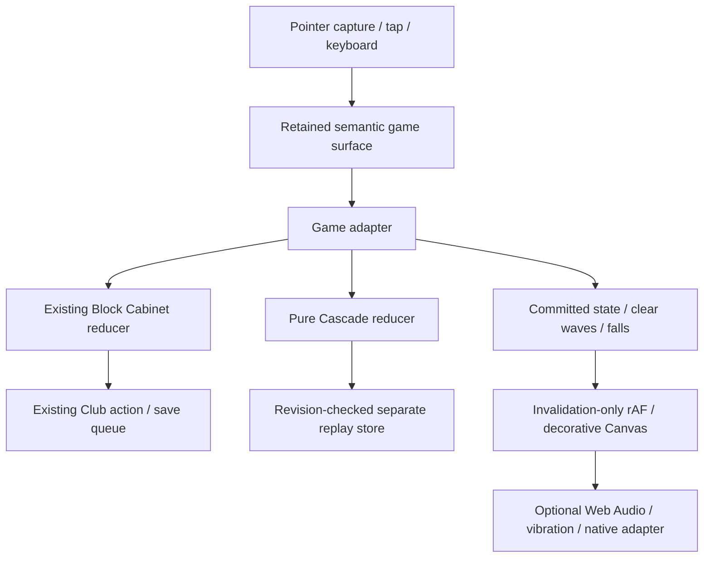

# Block Cabinet: tactile game engine

Implementation candidate, 2026-09-11. This is a web game surface and reusable presentation runtime, not an Android APK, a native renderer or a claim of measured phone performance.

## What changes

The production Block Cabinet receives a board-first tactile surface: pointer-captured dragging, raised touch pieces, whole-piece placement ghosts, prospective line highlights, placed-cell feedback, clear particles, score feedback, optional synthesized sound and vibration, keyboard and tap placement, undo/redo, and reduced motion. The old controls remain a recoverable fallback. The more complex **Cascade Cabinet** is a separate experimental game reached from the surface's game menu.

Classic keeps the exact existing `AlibiClubEngines.blockCabinet` rules, seed sequence, score, replay, revision and Club save. It does not adopt the prototype's demonstration deals. Cascade has its own explicit `cascade-cabinet-1` replay and separate `alibi-block-studio` IndexedDB database. Neither path alters `alibi-device`.

## Architecture

The engine is intentionally small. A puzzle game does not require an entity-component framework, physics world or continuous 60 Hz rules loop. Rules execute only on moves. Rendering runs during interaction and effects, then sleeps. A hidden tab cancels animation rather than simulating elapsed hidden time.

| Module | Responsibility |
| --- | --- |
| `src/game-feel/runtime.mjs` | Gesture ownership, cancellation, coordinate mapping, bounded frame statistics, optional feedback |
| `src/block-cabinet/surface.mjs` | Retained DOM board/tray, decorative Canvas, interaction state, effects and accessible controls |
| `src/block-cabinet/cascade.mjs` | Immutable deterministic experiment rules, gravity, scoring, replay validation |
| `src/block-cabinet/replay-store.mjs` | Revision-checked separate IndexedDB and explicit session fallback |
| `src/block-cabinet/studio.mjs` | Prototype and Cascade adapters, bounded import/export and recovery copy |
| `src/block-cabinet/integration.mjs` | Progressive adapter into existing Club actions and saves; original-control fallback |
| `src/block-motion-loader.js` | Lazy loading, bounded failures and optional offline pack caching |
| `tools/build-block-motion.cjs` | Hashed self-hosted bundle, checksum-checked artwork, standalone variant |

### Adapter contract

`read()`, `shape(id, rotation)`, `legal(state, slot, cell, rotation)`, `place(slot, cell, rotation)`, `undo()`, `redo()`, `canUndo()`, `canRedo()`, and `saveLabel()` form the surface boundary. Optional `new`, `import`, `export`, `simple` and `advanced` add capabilities without putting persistence or rules in the renderer.

A successful placement commits its deterministic outcome **before** decorative feedback begins. Cancelling, losing capture, resizing or backgrounding a drag never commits. The surface rejects off-board drops rather than silently snapping them onto a legal edge. Animation cannot alter score, random deals or game-over detection. Canvas is `aria-hidden`; real buttons retain the entire playable board.

### Why this should feel different

The old interface required selecting a piece and interpreting origin squares. The new surface also lets the piece follow the finger, shows its complete destination before release, previews the lines it would clear, and confirms the move. Browser packaging alone would not supply these behaviours.

The DOM is appropriate for 64 semantic cells and three tray controls. Canvas is used for ephemeral drawing. There is no per-pointer-move rebuild of the host application. Alibi currently replaces its Club page after actions; the adapter reattaches the retained surface after commits. Replacing that host seam with a first-class activity mount is a future simplification.

## Cascade Cabinet rules

Recover eight brass relics in at most 35 placements. Fill an entire row or column to clear it. Initially completed lines clear simultaneously; an intersection counts once for relic recovery. Remaining blocks fall vertically. Gravity may produce further full lines, which clear in successively scored waves. Gravity is not applied to ordinary placements without a clear.

Use all three dealt pieces before receiving another tray. A nonzero orientation costs one rotation charge when placed, and cleared lines restore charges up to three. Cancelling or previewing rotation spends nothing. Win by recovering all eight relics. The game ends on the placement limit or when no remaining piece fits in an affordable orientation.

This introduces planning across tray order, space, relic position, rotation budget and cascade opportunities. The generator does **not** guarantee every seed is winnable; difficulty and enjoyment require human calibration before promotion out of the lab.

## Storage and compatibility

Classic calls existing `AlibiClub.action` controls and awaits its save queue; it never writes Club data directly. The old 500-action replay bound is retained and surfaced. Simple controls expose the existing seed and Club backup tools.

Cascade validates bounded replay records rather than trusting imported board snapshots. Replay JSON is parsed and validated in a dedicated module worker before the replacement confirmation is shown. Imports are capped at 32 KiB and create a recovery export before replacement. Its IndexedDB write checks the previously read revision in the same read-write transaction, and adapter writes are serialized so rapid commands cannot persist stale snapshots. A stale tab cannot overwrite the newer record. Unavailable, blocked, corrupt, future-version or changed storage falls back to explicitly labelled session-only play without erasing the existing database; replacement imports are refused while that save is protected.

Cascade is **not included in Alibi's combined backup yet**. Its UI says to export separately. File-origin browser storage is not promised. The prototype's Classic demo is session-only with different demonstration deals; it is not a migration target for legacy saves.

## Delivery and assets

The production integration emits a small loader in the main bundle and loads the surface only on Block Cabinet. The optional pack has hashed JavaScript, CSS and a checksum-verified 3.6 KB WebP illustration. It is cached separately after loading and served by the existing service worker's same-origin asset fallback. Initial shell budgets exclude the separately measured pack; core budgets should not be raised merely to hide new work.

Artwork was generated through the Runway plugin and reduced to a low-detail background plate. Board cells, pieces, relic marks, highlights and particles are live authored geometry, not images of UI. Sound is synthesized locally. No runtime CDN, font download, generation API or external telemetry is added. See `assets-source/block-cabinet/PROVENANCE.json` in the integration layer.

## Run the prototype

From the repository root run `python -m http.server 8799 --bind 127.0.0.1`, then visit `/prototypes/block-cabinet/` on that server. This serves source modules, not the main application's `dist/`. Run `node --test tests/block-motion.test.mjs` for deterministic engine checks. The integration PR adds the normal production build hook and actual-control browser suite.

## Android path

The renderer works in a browser/PWA and can be reused inside a Capacitor WebView. That does not make it native graphics or guarantee lower latency. `createFeedback(nativeAdapter)` provides a narrow asynchronous `impact(kind)` extension point; no Capacitor dependency, signing key, Android project or fabricated device evidence is included.

Before distribution: benchmark a modest Android phone and a high-refresh device; validate OS gesture cancellation, back navigation, sound interruption, TalkBack, file export/import, storage pressure and lifecycle resume. Select native adapters where they solve observed problems. Native integration and store CI/CD are separate gated work.

## References

- W3C Pointer Events, capture/cancellation/touch-action: https://www.w3.org/TR/pointerevents3/
- Potential future native haptics adapter: https://capacitorjs.com/docs/apis/haptics

These references justify platform seams; they are not evidence of physical Android testing.
