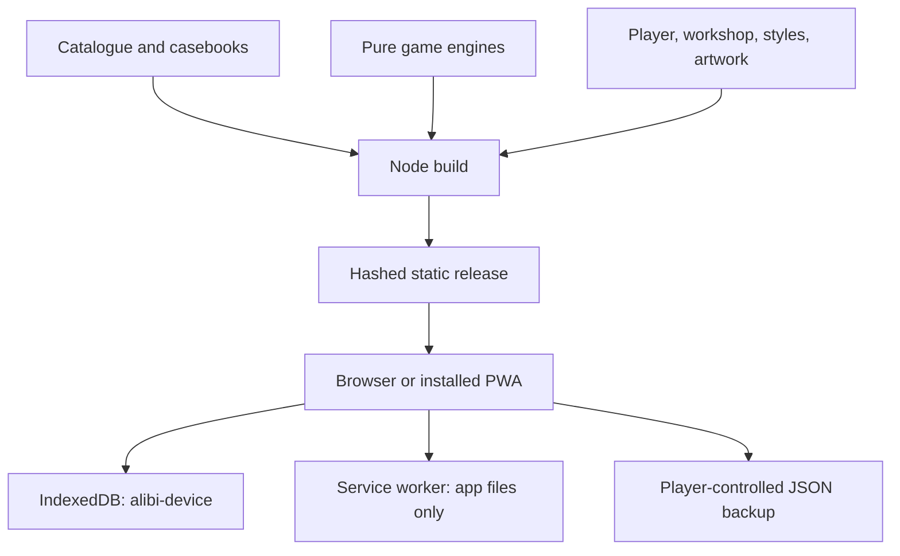

# Project map

## The original publishing bundle

| Bundle path | What it is | Disposition |
| --- | --- | --- |
| `alibi-deluxe-source/alibi/` | Editable 0.2.0 code, content, tests and docs | Imported into this root in four logical commits |
| `alibi-deluxe-cloudflare/` | Already-built static release | Rebuilt from source, not a second app |
| `alibi-deluxe-play.html` | Self-contained preview | Regenerated, ignored; used by isolated browser suite |
| `START-HERE.html` | Standalone upload guide | Retained with original input |
| `verification/` | Prior reports/screenshots | Historical evidence only |
| Manifest, build info, checksums | Original release identity | Build `04628f8c5791` reproduced before edits |

The supplied input remains untouched and ignored on this machine. Git contains the actual working
source and history, not duplicate deployment folders. No second repository is needed.

## Architecture

| Region | Responsibility |
| --- | --- |
| `src/core.js` | Scene and number/picture engines, base validation, solver, scene generation |
| `src/engines.js` | Dossier, witness, lightup, tents, aquarium, network and trail engines |
| `src/bridges.js` | Bounded Hashi engine, visibility graph, uniqueness solver and capacity deductions |
| `src/insights.js` | Clue-based reasoning hints and completed-record explanations |
| `src/storage.js` | Revision-conditional saves, labeled fallbacks and atomic restore |
| `src/app.js` | Routes, player, lessons, workshop, journal, backup and PWA lifecycle |
| `src/presentation.js` | Family rules, lessons, icons and decorative board previews |
| `src/app.css`, `src/cabinet.css`, `src/expedition.css` | Base boards/themes and public mobile cabinet styling |
| `src/artwork/`, `src/icons/` | Original casebook covers and supplied install icons |
| `content/catalog.json` | 116 published definitions; stable IDs and revisions |
| `content/legacy.json` | Forty compatibility fixtures, not more playable catalogue entries |
| `content/casebooks.json` | Four casebooks: Bellweather plus three earlier anthologies |
| `schemas/`, `examples/` | Pack format and portable authoring examples |
| `tools/` | Build, local server, pack validation, generation and bundling |
| `tests/` | Pure contracts, worker simulation, isolated controls and real-origin acceptance |
| `.github/` | CI and contribution templates |
| `.openai/hosting.json` | Exact Sites project and static output; no credential |

## Games and content

| Family | Count | Main interaction |
| --- | ---: | --- |
| Tidal bridges | 8 | Tap island pairs to cycle bridge counts |
| Crime scenes | 19 | Spatial placement followed by an accusation |
| Alibi files | 10 | People/room/object deduction matrices |
| Witness statements | 11 | Truth counts and culprit selection |
| Picture logic | 7 | Nonogram paint, cross, clear |
| Lanterns | 8 | Illumination and numbered-wall constraints |
| Tents & trees | 8 | Tree matching and edge counts |
| Aquariums | 8 | Shared water levels within tanks |
| Signal paths | 8 | Connected network rotations |
| Number trails | 8 | Consecutive path through every square |
| Sudoku | 7 | Row, column and box constraints |
| Sun & moon | 7 | Balanced binary lines without triples |
| Futoshiki | 7 | Latin square and inequality constraints |

Bellweather adds six original, chronological records. The earlier three casebooks are anthologies
of existing puzzles. Casebook entries reference catalogue IDs; they are not extra copies. Daily choices rotate from the catalogue using the device date. All progress is device-local.

## Known content work

Several imported scenes reuse roles/stories, and a few casebook aliases imply different objects
from their chapter's standalone puzzle. Do not silently rewrite published definitions to make
marketing copy fit. Curate revised definitions with explicit revision changes and retained saves.
Bellweather and Bridges curation decisions are in [BELLWEATHER-CURATION.md](BELLWEATHER-CURATION.md).
Human playtesting remains the next content milestone.
