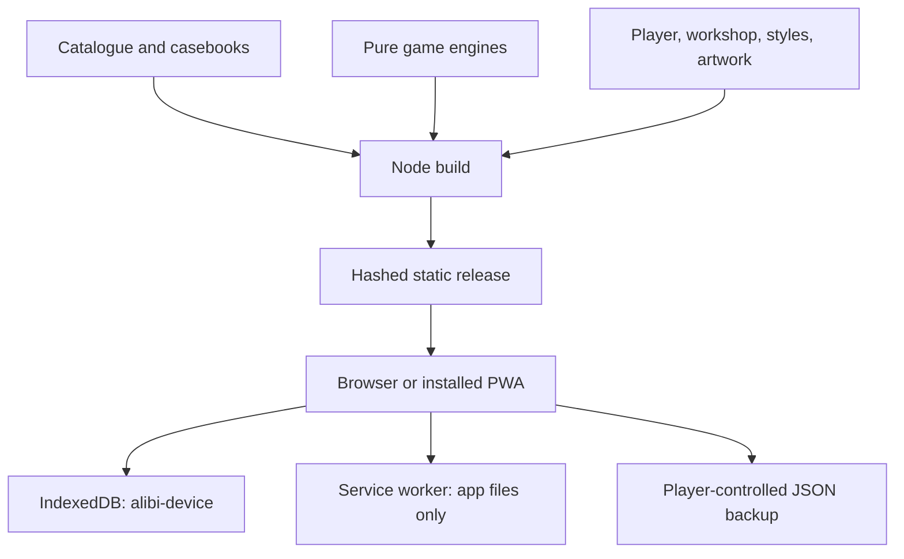

# Project map

## The original publishing bundle

| Bundle path | What it is | Disposition |
| --- | --- | --- |
| `alibi-deluxe-source/alibi/` | Editable 0.2.0 code, content, tests and docs | Imported into this root in four logical commits |
| `alibi-deluxe-cloudflare/` | Already-built static release | Rebuilt from source, not a second app |
| `alibi-deluxe-play.html` | Self-contained preview | Regenerated, ignored; used by isolated browser suite |
| `START-HERE.html` | Standalone upload guide | Retained with original input |
| `verification/` | Prior reports/screenshots | Historical evidence only |
| Manifest, build info, checksums | Original release identity | Build `04628f8c5791` reproduced before edits |

The supplied input remains untouched and ignored on this machine. Git contains the actual working
source and history, not duplicate deployment folders. No second repository is needed.

## Architecture

| Region | Responsibility |
| --- | --- |
| `src/core.js` | Scene and number/picture engines, base validation, solver, scene generation |
| `src/engines.js` | Dossier, witness, lightup, tents, aquarium, network and trail engines |
| `src/bridges.js` | Bounded Hashi engine, visibility graph, uniqueness solver and capacity deductions |
| `src/insights.js` | Clue-based reasoning hints and completed-record explanations |
| `src/storage.js` | Revision-conditional saves, labeled fallbacks and atomic restore |
| `src/app.js` | Routes, player, lessons, workshop, journal, backup and PWA lifecycle |
| `content/theatre.json`, `src/theatre.js`, `src/theatre.css` | Eight local rooms, optional sound/films, scene controls and presentation lifecycle |
| `src/asset-delivery.js`, `tools/build-delivery.cjs` | Verified optional image delivery, exact mirrors and bounded cache slots |
| `src/presentation.js` | Family rules, lessons, icons and decorative board previews |
| `src/app.css`, `src/cabinet.css`, `src/expedition.css` | Base boards/themes and public mobile cabinet styling |
| `src/artwork/`, `src/icons/` | Original casebook covers and supplied install icons |
| `content/catalog.json` | 116 preserved published definitions; stable IDs and revisions |
| `content/official-packs.json`, `content/curation/packs/` | Explicit trusted source registry: 335 puzzles across seventeen bounded packs |
| `content/curation/editorial/`, `src/curation.js` | Four standalone anthologies, provisional difficulty and completion-gated answer notes |
| `content/legacy.json` | Forty compatibility fixtures, not more playable catalogue entries |
| `content/casebooks.json` | Four casebooks: Bellweather plus three earlier anthologies |
| `schemas/`, `examples/` | Pack format and portable authoring examples |
| `tools/` | Build, local server, pack validation, generation and bundling |
| `tests/` | Pure contracts, worker simulation, isolated controls and real-origin acceptance |
| `.github/` | CI and contribution templates |
| `wrangler.jsonc` | Existing Cloudflare primary site and static output |
| `.openai/hosting.json` | Exact Sites fallback project and static output; no credential |

## Games and content

| Family | Count | Main interaction |
| --- | ---: | --- |
| Tidal bridges | 24 | Tap island pairs to cycle bridge counts |
| Crime scenes | 35 | Spatial placement followed by an accusation |
| Alibi files | 26 | People/room/object deduction matrices |
| Witness statements | 27 | Truth counts and culprit selection |
| Picture logic | 23 | Nonogram paint, cross, clear |
| Lanterns | 24 | Illumination and numbered-wall constraints |
| Tents & trees | 24 | Tree matching and edge counts |
| Aquariums | 24 | Shared water levels within tanks |
| Signal paths | 24 | Connected network rotations |
| Number trails | 24 | Consecutive path through every square |
| Sudoku | 23 | Row, column and box constraints |
| Sun & moon | 27 | Balanced binary lines without triples |
| Futoshiki | 23 | Latin square and inequality constraints |

Bellweather adds six original, chronological records. The earlier three casebooks are anthologies
of existing puzzles. Casebook entries reference catalogue IDs; they are not extra copies. Daily choices rotate from the catalogue using the device date. All progress is device-local.

## Known content work

Several imported scenes reuse roles/stories, and a few casebook aliases imply different objects
from their chapter's standalone puzzle. Do not silently rewrite published definitions to make
marketing copy fit. Curate revised definitions with explicit revision changes and retained saves.
Bellweather and Bridges curation decisions are in [BELLWEATHER-CURATION.md](BELLWEATHER-CURATION.md).
Two real players have enjoyed Alibi (owner report, 2026-09-09). Structured difficulty calibration remains open; see PLAYER-QA.md.

## After Hours

See [AFTER-HOURS-MAP.md](AFTER-HOURS-MAP.md) and its per-file inventory for the full second bundle.
`src/club-engines.js` adds five separately versioned games; `assist.js` adds reversible rules,
`club.js` and `club.css` implement the new desk/games/journal/Zen, and `atlas.js` draws the harbour.
`boot.js` supplies independent startup recovery. `optional-online/` is a separate, disabled-by-default
room service. The original 116-puzzle count is unchanged; six Archive rooms are additional games-room
content, and Borough/Duel are procedural/adversarial games rather than fabricated puzzle counts.

## Quiet Wing

[QUIET-WING.md](QUIET-WING.md) maps the third bundle and its evidence. `src/activities.js` owns
lazy mount/dispose; `src/quiet-wing/` owns the ported reducers, Canvas presentation and separate
save adapter; `tools/build-quiet.cjs` emits the optional pack. The root app owns native navigation,
combined backup discovery and updates. Four museum originals/records are in `assets-source/`,
with optimized pack files and receipts under `src/quiet-wing/assets/`. No combined distribution
bridge, second app manifest or second service worker is retained.

The expansion adds `city.js` and `gpu.js` for seeded modular layouts and shared Canvas/WebGL
geometry, `pet-view.js` for animated companions, `calm.js`/`calm-art.js` for the two new relaxing
families, and garden collection/postcard controls in `app.js`. Original model and museum receipts
are retained under `assets-source/quiet-wing/` and `assets-source/atmosphere/`. `atmosphere.js` and
`atmosphere.css` supply credited art on the existing Club and puzzle browsing surfaces.
`backup-validation.js` shares pure cabinet/Club validation with `validator-worker.js`; imports,
combined staging and subsequent section validation use its bounded worker. See RELEASE-0.6.0.md.

## Curation Cabinet

[CURATION.md](CURATION.md) records the 208-puzzle expansion, trusted source boundaries,
independent checks and human-playtest limits. The 59 additional classic/Club challenges are
separate experiences, never core imports or additions to the 335-puzzle count.

## Adaptive asset delivery

[ASSET-DELIVERY.md](ASSET-DELIVERY.md) defines offline capabilities and online enhancements.
`src/asset-delivery.js` upgrades visible museum images without blocking compact artwork or play.
`tools/build-delivery.cjs` emits hash-verified detail and the trusted mirror/CSP manifest from
`content/asset-delivery.json`. Optional detail bytes are outside the atomic core shell.
