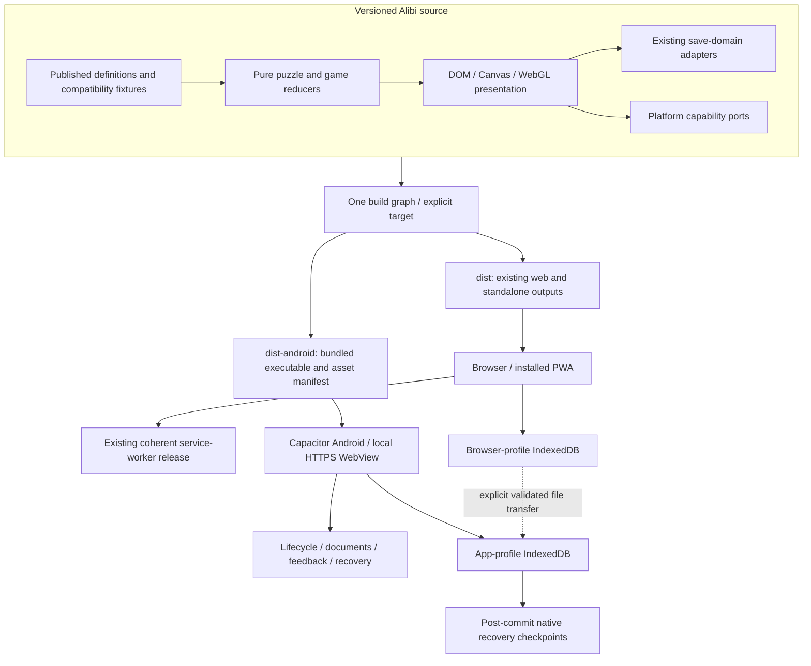

# Architecture: a native host around one Alibi

**Status: proposed; implementation tracked by #120 and CAP-01–CAP-14.** This document selects an Android-first Capacitor route without replacing the browser application or claiming a native build exists. Baseline: [source audit](SOURCE-AUDIT.md). Current upstream details: [sources](SOURCES.md).

## Intended result

Alibi remains a shared game: deterministic rules, published content, rendering and accessibility semantics. A small Android host supplies capabilities where the browser cannot provide the required contract. Distribution is native; most game presentation remains web technology. Capacitor does not itself improve a slow DOM tree, remove synchronous solver work or guarantee a frame rate. The shared game-feel work and device measurements remain necessary.



This is not a second frontend. Do not add React, Ionic UI, a new state framework, an entity-component engine or a Kotlin rendering rewrite to accomplish packaging. Use a maintained rendering library only for a measured presentation need, independent of the native host.

## Decisions and alternatives

| ID | Proposed decision | Reason / rejected shortcut |
| --- | --- | --- |
| ADR-01 | One shared game core; explicit `web` and `android` build targets | Avoid divergent rules, content and inaccessible native-only controls |
| ADR-02 | Android loads bundled local code, never the live PWA as its main document | A hosted shell would couple installed builds to web releases and bridge untrusted changes |
| ADR-03 | Keep Android origin `https://localhost` stable once preview persistence starts | Scheme/host changes are data migrations; this is not iOS's `capacitor://` origin |
| ADR-04 | Web SW stays; Android SW is disabled deliberately | One authority per release path; `standalone` is not an Android flag |
| ADR-05 | Existing IndexedDB writers initially remain authoritative | Preserve tested CAS/validation; a simultaneous SQLite rewrite multiplies migration risk |
| ADR-06 | Add a bounded native recovery vault before promising native recovery | Recovery copies are not a second mutable source of truth; explicit restore only |
| ADR-07 | Bundle the current production asset set for the first native vertical slice | Prove offline capability before introducing download-manager complexity |
| ADR-08 | Native feedback and device APIs are narrow injected ports | No plugin imports in reducers and no per-frame bridge traffic |
| ADR-09 | No over-the-air executable updates in the first native release | Store artifact, tests and runtime code remain the same reviewed unit |
| ADR-10 | Separate web and Android release identities; immutable artifact promotion | A successful Cloudflare deployment is not an Android update |
| ADR-11 | Native telemetry off; no account, ads, billing or hosted rooms added | Each would introduce unrelated consent, network and operational work |
| ADR-12 | Actual device evidence gates public quality claims | Emulator/device-shaped screenshots cannot certify touch, TalkBack, heat or storage faults |

These are recommendations for the transition. Publisher, production applicationId, approved distribution countries, support/privacy endpoints and release approver remain owner decisions. A new domain is optional, not a prerequisite for a bundled app. Keep both existing web origins available.

## Proposed code layout

Paths below are implementation destinations, **not files already shipped by this PR**:

```text
src/platform/
  contract.mjs                 # runtime guards / capability result helpers
  web.mjs                      # no Capacitor dependency
  android.mjs                  # only entry importing native plugins
src/save-domains/
  registry.mjs                 # adapters for existing five stores
  checkpoints.mjs              # post-commit snapshot orchestration
src/native-entry.mjs           # selects Android ports before app bootstrap
native/plugins/
  recovery-vault/              # narrow app-private atomic snapshots
  documents/                  # SAF selection and bounded document handles
android/                       # reviewed generated host, maintained as source
capacitor.config.json           # generated from approved identity + policy
native/release-identity.json    # public IDs only, never signing material
tools/build-android.cjs         # consumes shared graph, emits dist-android
tools/check-android-artifact.cjs
```

Keep the current application modules operational while extracting these seams. The declaration in [contracts/platform.d.ts](contracts/platform.d.ts) describes intended interfaces; it is not an implemented plugin. A native adapter may use a maintained official plugin underneath, but the game depends on the contract rather than that plugin's API shape.

### Dependency direction

`rules -> ordinary data` only. Presentation sends commands to existing domain adapters. Host code calls platform ports; native results are validated before influencing navigation, files or recovery. Neither an imported puzzle nor a content-pack field may select a native method, filesystem path or executable URL.

Capabilities describe what is actually usable, not what was compiled into the package. Missing vibration, refused document access or a failed optional image is a degraded affordance, not a failed game. Save/recovery errors are different: expose them and protect existing records rather than silently treating them as optional.

## Build and bootstrap contract

Add a target field distinct from the existing preview flag:

```text
BuildIdentity = {
  target: web | android,
  appVersion, sourceSha, payloadSha256,
  contentManifestRevision, rulesCompatibility,
  saveEnvelopeVersions
}
```

The web target retains its manifest, SW, `_headers`, existing Cloudflare bundle and self-contained demonstration output. The Android target selects the native entry, packages local code/resources, excludes hosting-only files and emits a full asset receipt. It must not include secrets, source masters or signing files.

The Android boot sequence is:

1. Show the native splash while starting a local WebView; install error handling and native ports before entering the app.
2. Validate the bundled release manifest and required runtime capabilities. Run no network request to decide whether offline play is allowed.
3. Open existing save domains with their bounded deadlines; do not wait for optional activities merely to render recovery UI.
4. Hydrate the requested safe route from committed state, then expose ready or a usable protected/recovery state. Hide the splash in either case; a failed database must not leave a permanent spinner.
5. Mount the active scene, subscribe owned listeners, and enable optional feedback after applicable user settings/gesture requirements.

Never register `sw.js`, wait on `serviceWorker.ready`, or expose PWA install/update controls in the Android target. Conversely, do not unregister browser workers or delete caches on the web target. A hypothetical earlier experimental native build with a stray SW requires an origin-scoped migration with a specific allowlist, not `delete all caches`.

The [example configuration](examples/capacitor.config.json) uses an intentionally unapproved ID. The plan validator checks it as a design fixture and **refuses release readiness**. It is not a root Capacitor configuration or a working APK scaffold.

## Toolchain and plugin strategy

Use the separately observed versions in [S01](SOURCES.md#s01--capacitor-toolchain) as candidate pins. Scaffold once, inspect the generated Android project, record exact Node/JDK/SDK/AGP/Gradle versions and dependency checksums, then prove both debug and release-like builds. Do not install floating `latest` versions in CI or assume plugin versions match core.

Initial host candidates: core/Android/CLI, App and optional Haptics. SystemBars is part of core. Add Share only when the user-facing sharing path exists. Add filesystem/transfer tooling only for a defined storage or media operation; SAF is not magically supplied by an arbitrary file download plugin. Prefer a small maintained document adapter to an abandoned broad-access plugin. RecoveryVault is purpose-built because the required generation, validation and atomicity contract is narrower than generic file writes.

Every plugin gets an inventory entry: package/native dependencies, licence, maintenance status, permissions, data access, browser fallback, failure semantics, lifecycle owner and test evidence. Avoid adding native HTTP, analytics, advertising, push, Play Games or SQLite just because they are available.

## Save and content compatibility

The Android app's local origin is separate from browser profiles, even though game IDs are shared. Migration is explicit export/preview/import; source data remains untouched. Retain five existing database identities and all published definitions. An installed application may execute older bundled code than the current web site; export schemas must therefore have explicit readers, unknown-field protection and compatible content/rule revisions.

The native RecoveryVault stores committed snapshots and verifies generations. It never participates in a game's decision logic or automatically wins over a newer database. A future native SQLite adapter can replace a domain behind the same contract after a separate ADR and migration proof. Avoid long-lived dual writes to IndexedDB and SQLite.

Executable activity code is bundled for every feature advertised in the native listing. Optional pack delivery can later fetch inert media/data with declared compatibility and trust; it cannot quietly turn into a JavaScript updater. More detail: [data](DATA-AND-MIGRATION.md) and [assets](ASSETS-AND-UPDATES.md).

## Incremental integration order

First establish target-aware build and web-fallback ports. Then generate a non-publishable host and prove offline launch of a current game. Next add save registry/recovery and file transfer; then lifecycle, asset resolution and device feedback. Finally harden, measure, automate distribution and run the beta gates. #115/#117 can consume these interfaces after their own merge and verification; they are not a prerequisite for the architecture PR.

Each slice keeps a working PWA. Each native release is reviewable without hidden external configuration. The [roadmap](ROADMAP.md) gives actual issue links and dependencies; the [acceptance matrix](ACCEPTANCE.md) defines what qualifies as evidence.
