# CI/CD, Play release and operating model

**Proposed workflows, not active YAML.** Implementation: #133 (CI), #134 (delivery), #135 (launch), #136 (operations). This planning PR does not install an SDK, create credentials, sign a build or publish an app.

## Release topology

```mermaid
flowchart LR
  PR[Pull request] --> WebCI[Existing PWA verify]
  PR --> NativeCI[Native build / policy / emulator checks]
  WebCI --> Review[Review and merge]
  NativeCI --> Review
  Review --> Web[Independent Cloudflare release]
  Review --> Reserve[Native release preparation / reserve versionCode]
  Reserve --> Build[Build exact source without production secrets]
  Build --> Evidence[Payload / manifest / tests / provenance]
  Evidence --> Sign[Protected upload-key signing]
  Sign --> Internal[Play internal track]
  Internal --> Closed[Closed testing / reviewed candidate]
  Closed --> Approval[Approve exact artifact and listing]
  Approval --> Production[Initial launch or staged update]
```

The same source can feed both targets, but merging a PR must not automatically ship a native production release. A web deploy is not a native release. AAB promotion reuses the exact tested artifact, not a rebuild from whatever `main` contains later.

## CI lanes and cost control

Keep the current required `verify` check and existing gameplay/storage/offline suites. Native lanes should be separate, visible and read-only for ordinary PRs. The matrix below is a future classifier design, not permission to disable existing tests in this architecture PR.

| Change | Required evidence |
| --- | --- |
| Planning/docs only | Plan consistency/link/negative tests; existing required repository checks remain in force |
| Pure rules, content, shared storage or UI | Existing web verification plus affected native shared/runtime tests |
| Native plugin/config/manifest/Gradle | Native lint, compile, policy checks and relevant emulator tests; targeted shared-contract checks |
| Build graph, release scripts, unknown/shared boundaries | Full relevant web/native matrix |
| Assets only | Provenance/hash/decode/size checks and affected scene smoke on both targets |
| Release candidate | Full matrix plus exact-artifact upgrade and physical acceptance evidence |

Use an always-running result aggregator rather than a workflow-level path filter that leaves a required check pending. "Not affected" needs an explicit classifier result; unknown paths select full coverage. Cache dependencies by OS, architecture, lockfile and toolchain. Do not let untrusted PR jobs populate privileged caches or reuse unverified mutable build outputs for release. Cancel superseded PR builds, but do not cancel an in-flight signing/upload transaction just because another commit arrived.

### Proposed jobs

- `web-verify`: existing Node/content/browser/storage acceptance.
- `android-policy`: effective Capacitor config, dependency/plugin inventory, wrapper checksums, merged permissions/components, target/runtime asset closure.
- `android-build`: pinned Linux/Node/JDK/Gradle/SDK; `cap sync android` from the verified `dist-android`; lint and debug/release-like build.
- `android-emulator`: install and exercise actual WebView/Activity behaviour, including process recreation and offline startup.
- `android-upgrade`: previous accepted APK -> current candidate with representative saved data, no uninstall/data clear.
- `verification-summary`: exact-source test results and declared omissions, fails on required skipped/failed jobs.

Do not call `cap add android` every run. Keep generated host source and reviewed configuration in Git, regenerate copied runtime assets, and compare their receipt to the shared payload. Use pinned action SHAs and dependency verification; record the actual SDK/build tools and Gradle distribution hash. No self-writing application-source workflows, repository-rule changes or `pull_request_target` execution of untrusted code with credentials.

The emulator matrix should cover the lowest **supported and tested** OS/WebView combination, the current target OS and a 16 KB configuration where applicable. Verify feature support separately from minSdk. Debug-only success is insufficient: R8/resource shrinking, CSP and release config can behave differently. Generate/install test APKs from the bundle where useful. Physical phones still own tactile, TalkBack, audio, thermal and OEM transfer acceptance.

## Identity and version allocation

Before a Play app record is created, #123 settles publisher/application identity and signing ownership. A preview app must have a separate, clearly labelled identity and cannot be mistaken for the production app. Changing applicationId later creates a different installed application; changing WebView origin is a save migration.

Use separate version dimensions from [ASSETS-AND-UPDATES.md](ASSETS-AND-UPDATES.md). Android `versionCode` is allocated globally, never independently per workflow or track. A workflow's `run_number` is not a safe cross-workflow allocator.

Recommended small-team allocation: a reviewed release-preparation PR reserves a new code in an append-only `native/releases/<versionCode>.json` ledger, associates it with source/release intent, then a trusted release tag identifies the merged reservation. Never reuse a reserved code, including failed releases. Serialize publish operations per applicationId and reconcile with all known Console/manual uploads. Manual uploads must reserve codes through the same process. Record an uploaded artifact digest and Play result beside the reservation; don't infer successful submission from a tag alone.

## Build once, then sign

1. Resolve the approved immutable source/lock/toolchain inputs and reserved versionCode.
2. Build and test without production keys. A non-production test signature may exercise release-like code on emulators; it is not the Play distribution identity.
3. Produce the unsigned AAB and payload manifest with source SHA, input hashes, dependency inventory and verification receipts. Artifact policies reject remote-main URLs, debug settings, unapproved plugins and missing bundled assets.
4. A protected signing job accepts only those exact reviewed artifacts. It materializes the upload keystore temporarily, signs the bundle and removes material on success, error and cancellation. Do not run arbitrary build hooks with signing credentials.
5. Record the signed AAB SHA-256 and certificate details. Downstream jobs accept this digest and versionCode, not a mutable artifact name.

Play's app-signing key is distinct from the upload key used by CI. Association files and certificate-bound integrations must use the certificate set actually distributed by Play, including an approved rotation lineage when applicable. See [S06](SOURCES.md#s06--play-account-testing-and-signing). No keystore, password, service-account JSON or private identity evidence belongs in Git, build logs or public artifacts.

## Play API authentication and uploader choice

Provision a Google Cloud project/API and service account with narrowly scoped Play Console permissions. Prefer short-lived GitHub OIDC federation plus service-account impersonation, bound to this repository, trusted ref and the selected protected environment. The permission to mint an identity token is not permission to publish; Play permissions remain separate. [S07](SOURCES.md#s07--publication-automation-and-disclosures) supplies the official setup references.

Select Gradle Play Publisher, fastlane or a small official-API uploader only after proving that the chosen version supports the intended token/ADC flow, track edits and retries. No specific third-party tool is assumed to be configured by this plan. If a long-lived key is temporarily required, document why, scope it narrowly, store it only in a protected secret store, rotate it and define removal criteria.

Start with a dry-run and an internal-track proof. A script that compiles is not evidence it can authenticate. First app/Console setup may need a manual bootstrap before API-managed releases are possible. Handle API quota/review errors explicitly. On timeout, reconcile the versionCode, digest and edit state before retrying; do not create duplicate releases or reassign a code to different bytes.

### Environments

| Environment | Access / purpose |
| --- | --- |
| PR CI | Read-only repository/token; no signing or Play access |
| `play-internal` | Approved release ref, upload credentials, internal-track permissions |
| `play-production` | Explicit approver, exact candidate digest/listing revision, minimal promotion permissions |

Signing/upload jobs operate from trusted workflow definitions and check the source/artifact origin. Production approval must display the AAB digest, versionCode, target countries, current compatibility evidence and listing/disclosure revision. A newer merge cannot change the approved candidate under the same label.

## Store readiness and beta

The current primary-source snapshot requires phone submissions to target API 36 from 31 August 2026; verify again in the actual account. Review current 16 KB/native-library compatibility and all applicable quality warnings rather than copying old dates. [S05](SOURCES.md#s05--store-compatibility).

#135 prepares store name/short/full description, icon, feature graphic, real device screenshots, category, support contact and accessible privacy URL. Record exact asset dimensions and Console validation at preparation time. Complete content rating, target audience, ads, app access and Data Safety accurately for the actual native build. Review artwork/audio rights and original/generated asset receipts. Do not advertise Cascade as a native capability, global rankings or cloud sync that are not shipped.

For applicable new personal developer accounts, the documented gate is at least twelve continuously opted-in closed testers for fourteen days, then an application for production access. Recruit a buffer and obtain actual feedback; internal testing is not the qualifying track. Account/device/organization verification and Google review remain external gates. No automatic approval is promised. See [S06](SOURCES.md#s06--play-account-testing-and-signing). Keep tester addresses and identity documents private.

A beta should include fresh users, users with mature PWA saves, a modest Android device, a high-refresh device and accessibility testing. Have them exercise actual export/import, offline installation, interrupted play and return after several days. A scripted bot population is not a substitute for the required human testing.

## Initial launch and staged updates

The first production launch cannot use percentage staged rollout. Select approved countries/device availability deliberately, complete closed-test/device gates first, and reserve support/observation capacity. Do not label a country-limited launch as a staged percentage.

For subsequent updates, a proposed ladder is 5% -> 25% -> 50% -> 100%, advancing only after a defined observation window and enough evidence to evaluate failures. Do not advance automatically just because a timer expired; low traffic may be inconclusive. Stop for data-loss reports, startup/ANR regressions, broken migration, severe interaction/accessibility faults or missing required content. Separate native vitals from JS-level diagnostics. Current mechanics: [S06](SOURCES.md#s06--play-account-testing-and-signing).

## Incident / recovery runbook

1. Identify exact versionCode, AAB digest, content/rules revisions and affected device/WebView; ask for a user-reviewed diagnostic export, not a full private backup by default.
2. Halt further rollout where supported. Preserve artifacts and symptom evidence; do not tell players to uninstall or clear site data.
3. Determine whether the fault is executable code, incompatible content, asset activation, native lifecycle or storage. A web rollback cannot repair bundled Android code.
4. Prepare a higher-versionCode roll-forward using a reader compatible with all already-written schemas. Reverting source is not permission to downgrade schema readers.
5. Validate an upgrade from the bad build with representative data and checkpoint generations. Test interrupted repair and explicit recovery options.
6. Publish through the controlled lane, monitor, then document the cause and regression test. A halted rollout does not undo installations already completed.

Media packs have their own active-manifest rollback that never deletes saves. Upload-key loss follows the documented Console reset/ownership process; app signing identity is not casually replaced. Practise these steps with synthetic builds before first production.

## Receipts and maintenance

For every candidate retain: source SHA, payload hash, AAB hash, versionName/code, signing fingerprints, toolchain/locks, asset manifest, save/rules compatibility, test results, physical device receipt, listing/declaration revision, approver and Play outcome. Keep private mappings/identity evidence in restricted storage; this is a public repo, so ordinary public Actions artifacts are not a private vault. Synthetic test evidence can be public.

Assign a release/signing custodian and a support owner before launch. Review dependencies/plugins/WebView behaviour and policy monthly; plan annual target-SDK work early; rehearse recovery and key custody quarterly or after material changes. Minor dependency releases can carry migration work. No paid CI/OTA service is necessary for this design; exact Actions, hosting, registry/account and device costs must be approved separately when provisioned.
