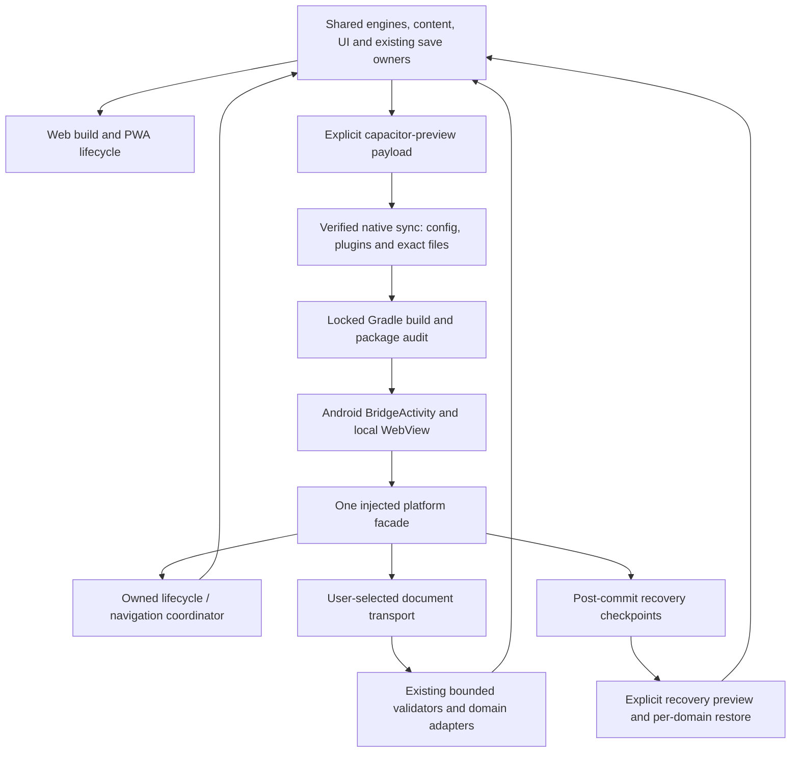

# Android native readiness: 29 September 2026

Program [#120](https://github.com/Chris0Jeky/Alibi/issues/120). This is a current-source audit and implementation design, not a production release receipt. Baseline: `f41c452dfeb659e733ae3e5fcfb479d7df5f1fff`, tree `abe58a5a90c51f6c32199b0fe6ccf86e459c2e16`. The supplied archive reproduced that entire Git tree, including executable modes. Live branches and CI remain authoritative after this baseline.

## Decision

Continue **Capacitor with a bundled Android host and shared game engines, rendering and content**. Do not restart the already implemented host or rewrite the catalogue in Kotlin. Native here means an installed Android application with a real Android lifecycle and narrowly controlled native integrations, not that every puzzle is rendered using Android widgets.

A Kotlin/Compose rewrite would establish a second rendering and interaction implementation and require replay, accessibility and save compatibility work across the full catalogue. It would not itself fix the reported completion freeze. A Trusted Web Activity would retain a stronger dependency on browser/origin installation and would not implement the intended private recovery/document ports. The existing Capacitor architecture offers the shortest testable route while keeping the PWA a first-class product. Its cost is that WebView correctness, memory and lifecycle must be tested explicitly. Packaging is not an automatic frame-rate improvement.

## What actually exists

| Area | Source evidence at baseline | Remaining boundary |
| --- | --- | --- |
| Build graph | `tools/build-android.cjs`, explicit `browser-preview` and `capacitor-preview`, hashed payload receipts, no root PWA worker in the native payload | A payload receipt is not an APK, install or startup test |
| Android project | Committed wrapper, AGP configuration, dependency locks/verification, `MainActivity`, stable local origin, deliberately unapproved preview identity | Full CAP-04 acceptance remains open |
| Platform seam | Explicit Android bridge/origin/flavor checks in `src/platform/android.mjs`; immutable facade | Only `nativeHost` is true; documents, native feedback and recovery remain unavailable |
| Persistence | Existing device-local stores, validators and explicit exports | No completed native recovery registry; no automatic access to Chrome/PWA storage |
| CI | `android-payload.yml` checks a browser-emulated payload | No maintained workflow compiles or installs the native host at this baseline |
| Insets | SystemBars is configured for CSS inset injection | Existing padding owners read `env()` but not injected `--safe-area-inset-*` values |
| Security | Local origin, restrictive native CSP, backup exclusions, release variant disabled | Generated bridge metadata is only existence-checked; template FileProvider paths need narrowing before file transport |
| Release | Debug and non-debuggable, debug-signed `capacitorPreview` variants | No approved production ID, upload key, AAB, Play promotion or launch authorization |

The September 22 record in this directory describes an earlier successful APK/emulator rehearsal. Preserve that evidence, but do not label it acceptance of September 29 source. Conversely, do not describe the host as unimplemented merely because the original architecture documents are older.

The native adapter inherits browser lifecycle, feedback and external-link operations. That is a useful fallback, not native App/back integration. Adding a capability flag before the corresponding bridge, ownership and failure tests exist would make the app less trustworthy.

## Defects and risks selected for this wave

**1. The sync trust boundary is incomplete.** `checkPublicPayload` compares web files but accepts arbitrary bytes in the two generated Cordova files and merely requires the sibling config/plugin files to exist. Missing source directories can also collapse into an empty file set. For the pinned plugin-free preview, the upstream CLI deliberately emits two empty Cordova files, an empty native plugin registry and the copied configuration. Reject deviations rather than accepting remote URLs, newly registered plugins or stale files because they were generated. Preserve a separate byte-for-byte comparison of all real payload files.

**2. The package is not checked continuously.** Gradle consumes more than `dist-android`: native source, manifests, dependency resources and Capacitor's `assets/native-bridge.js`. Add read-only native compilation, APK closure checks and one real WebView instrumentation smoke. Bind receipts to the checked-out source and actual APK bytes. This first smoke is intentionally narrower than every-game, process-death, picker and accessibility acceptance.

**3. Native inset fallback is disconnected.** Capacitor documents incorrect `env(safe-area-inset-*)` values in older Android WebViews and injects CSS custom properties as the fallback. Consume those at the existing navigation, sheet, toast and immersive-game padding owners. Do not add blanket root padding on top of existing bottom padding. Test zero and nonzero values, portrait/landscape, variable updates and the ordinary browser fallback. Such browser fixtures are not a physical cutout or IME test.

**4. Progress and interruption remain the largest product risk.** Five domains are planned for the transfer registry; Cascade remains a separately excluded boundary. Existing combined backups must not be called complete native transfer. New case/escape-room rehearsal PRs are memory-only and are not production-native content until their activity/save integration is accepted. Report per-domain commit/recovery outcomes, not imaginary cross-database atomicity.

**5. The Android freeze is still a device gate.** #426/#421 isolates completion hooks and is relevant hardening, but neither that patch nor a native package establishes the physical cause of #11. Preserve saves and retest the affected device rather than recommend clearing storage.

## Architecture and ownership

The latter lifecycle/document/vault boxes are delivery boundaries, not claims that all are implemented. Keep the stable `https://localhost` origin. Changing hostname/scheme is a storage migration, not cosmetic configuration. Native code must never accept method names, arbitrary paths or executable URLs from puzzle imports. Do not add remote application code, an OTA updater, a second router, a new game engine or a second save authority.

### Durability and migration

CAP-05 (#127) should first implement a domain registry around the existing save owners, including explicit exclusion/status for Cascade and session-only material. Commit a validated move to its current store before scheduling a bounded recovery snapshot. Native vault failure must not undo a valid move or pretend that a checkpoint exists. Use generation IDs, checksums, bounded retention and explicit restores; retain a previous valid checkpoint through interrupted replacement. Native storage does not turn the existing multi-database import into an atomic transaction.

CAP-06 (#128) then owns SAF transport. A picker result is a capability token, not an arbitrary filesystem path. Stream with byte bounds before parsing, reuse the existing validator worker, preview all included/missing sections, and give cancellation a no-write guarantee. Deduplicate restored external-activity results by operation ID. Report a destination write only after close, and distinguish read-back-verified bytes from narrower provider acknowledgements. Keep both existing PWA origins recoverable and do not instruct users to uninstall them during transfer.

### Lifecycle, navigation and feel

CAP-08 (#130) should install one owner for native App listeners and dispose only its own handles. A pending listener registration that resolves after disposal must still be removed. Backgrounding cancels gestures without moves, suspends feedback/rendering and requests a bounded flush; it is not a guaranteed final callback before death. Resume must not replay an import or activate a new content revision silently.

Back handling requires a synchronous priority decision: active gesture, modal, sheet, application route, then system root behavior. Installing a back listener replaces Capacitor's default behavior, so root exit must be intentional and tested. Do not infer native history from an unrelated browser `popstate` callback. Predictive Back, external links and IME/cutout behavior need actual Android tests.

CAP-09 (#131) retains measured frame/input latency, long-session memory/thermal behavior, TalkBack and large-text gates. Native haptics should follow a committed action and stay optional; no bridge call per rendered cell or pointer movement. Optimise decoding and scene disposal only after measuring a representative device, not by adding a heavier game framework.

### Security and package policy

CAP-10 (#132) remains broader than this wave. Native web security comes from packaged configuration/CSP and Android policy, not the hosted `_headers` file. Require explicit cleartext denial in the merged manifest and disallow unexpected exported components/permissions. Keep the preview's automatic-backup exclusions. Android/OEM data-transfer behavior still needs device verification. The template FileProvider's broad external/cache paths are recorded as a remaining hardening item before enabling native documents; an unexported provider alone is not a complete path policy.

For this slice, the empty plugin registry is a deliberate allowlist. A future App/SAF/haptics plugin addition must update reviewed policy, dependencies, locks, package tests and declared capabilities together. Capacitor's own bundled bridge asset must match its installed pinned package, rather than being overlooked because it is outside `assets/public`.

## Delivery sequence and acceptance

1. **Native foundation, #126/#132/#133:** failing sync-policy regressions, implementation, source tests, debug/non-debuggable preview builds, actual APK/manifest receipts, one native offline cold-boot smoke. Preserve full PWA verification. No production signing or publication.
2. **Inset integration, #130:** reuse existing padding owners and add computed-style/browser evidence. Run on the existing WebView-floor device before claiming native visual acceptance.
3. **Registry then recovery, #127:** exercise interrupted commit/checkpoint/restore, corrupt and future formats, bounded work and six-domain inventory status. Do not enable auto-restore.
4. **Native lifecycle/back, #130:** native App adapter and one coordinator, raced disposal tests, gesture/modal/root-back integration, pause/resume and process recreation.
5. **Documents and migration, #128:** provider cancellation/stalls/revocation, five-domain preview plus excluded material, source preservation, partial restore and duplicate external results.
6. **Quality/release, #129/#131/#134-136:** every-feature offline evidence, memory, TalkBack, exact-candidate upgrade tests, approved identity/custody, signed AAB and genuine Play testing. Recheck current Console requirements in the owner's account; do not freeze old policy dates into an automated launch decision.

Merge is separate from deployment. Require exact-head checks, independent review and repository head aging; no branch-protection change, self-approval or workflow that pushes generated fixes. A source test, a browser simulation, an emulator run and a physical-device result must retain distinct labels.

## Sources checked for this design

Retrieved 29 September 2026. Versioned source is used for generated-file assertions; rolling documentation explains platform behavior and must be rechecked when dependencies change.

- [Capacitor 8 SystemBars](https://capacitorjs.com/docs/apis/system-bars): core-bundled integration and CSS inset fallback.
- [Capacitor configuration](https://capacitorjs.com/docs/config): local server, debugging, logging, WebView floor and security-relevant options.
- [Capacitor App](https://capacitorjs.com/docs/apis/app): native lifecycle, owned listeners, restored results and default-back replacement.
- [Capacitor 8.5.2 Cordova generation](https://github.com/ionic-team/capacitor/blob/8.5.2/cli/src/cordova.ts): empty files when no Cordova plugins are installed.
- [Capacitor 8.5.2 native sync](https://github.com/ionic-team/capacitor/blob/8.5.2/cli/src/android/update.ts) and [config copy](https://github.com/ionic-team/capacitor/blob/8.5.2/cli/src/tasks/copy.ts): registry generation and copied configuration.
- [Android apkanalyzer](https://developer.android.com/tools/apkanalyzer): decode the actual APK manifest rather than infer it from source XML.
- [Android page sizes](https://developer.android.com/guide/practices/page-sizes): library/package alignment and device evidence are separate. Absence of native libraries is an inventory result, not a physical compatibility certificate.

## Evidence at intake

Six existing native-adapter/bootstrap Node tests passed locally. Full dependency installation could not complete: the offline npm cache lacks `youch-core@0.3.3`. No local APK build, physical device, Play Console check or new emulator pass is claimed here. Implementation and CI receipts must be recorded on the eventual PR at its actual head, not retroactively inserted as baseline evidence.
