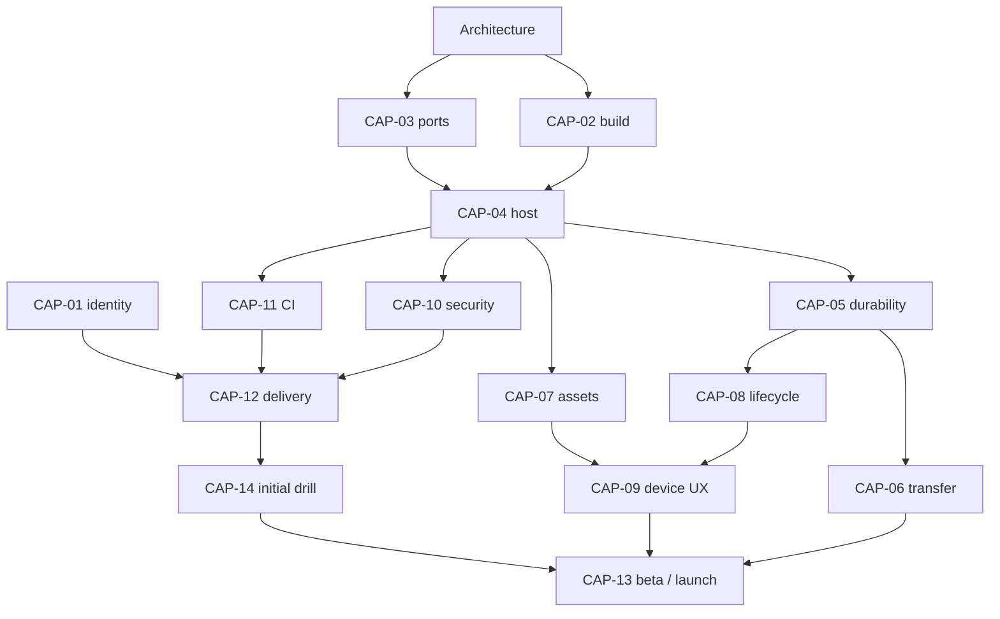

# Transition roadmap and agent handoff

Program owner issue: [#120](https://github.com/Chris0Jeky/Alibi/issues/120). All CAP work below is **open implementation work**, not completed by the architecture PR. Machine-readable mapping: [plan.json](plan.json).

## Work packages

| ID / issue | Deliverable | Dependency / completion gate |
| --- | --- | --- |
| CAP-01 [#123](https://github.com/Chris0Jeky/Alibi/issues/123) | Publisher, production identity and signing custody | Owner verification before production registration; does not block portable architecture |
| CAP-02 [#124](https://github.com/Chris0Jeky/Alibi/issues/124) | Explicit dual-target build and bootstrap | Architecture review; unchanged PWA, no native SW |
| CAP-03 [#125](https://github.com/Chris0Jeky/Alibi/issues/125) | Narrow platform ports and browser fallbacks | Architecture review; tested failure/disposal contracts |
| CAP-04 [#126](https://github.com/Chris0Jeky/Alibi/issues/126) | Pinned Capacitor Android host | CAP-02/03; preview identity cannot be uploaded as production |
| CAP-05 [#127](https://github.com/Chris0Jeky/Alibi/issues/127) | Five-domain registry and native RecoveryVault | CAP-03/04; post-commit, generation and failure proofs |
| CAP-06 [#128](https://github.com/Chris0Jeky/Alibi/issues/128) | SAF documents and PWA/native migration wizard | CAP-03/04/05; both origins, every supported domain, explicit recovery |
| CAP-07 [#129](https://github.com/Chris0Jeky/Alibi/issues/129) | Asset resolver and bundle/offline contract | CAP-02/03/04; complete first offline installation |
| CAP-08 [#130](https://github.com/Chris0Jeky/Alibi/issues/130) | Lifecycle, back, insets, external results | CAP-03/04/05; no lost/duplicate actions during interruptions |
| CAP-09 [#131](https://github.com/Chris0Jeky/Alibi/issues/131) | Measured game feel, performance and accessibility | CAP-04/07/08; existing physical gates remain authoritative |
| CAP-10 [#132](https://github.com/Chris0Jeky/Alibi/issues/132) | Bridge hardening, network/backup policy and privacy | Starts after CAP-04; final audit covers CAP-05–08 |
| CAP-11 [#133](https://github.com/Chris0Jeky/Alibi/issues/133) | Native PR CI and emulator/artifact matrix | CAP-02/04; expand coverage as features land |
| CAP-12 [#134](https://github.com/Chris0Jeky/Alibi/issues/134) | Signed AAB/internal delivery and exact-artifact promotion | CAP-01/10/11; authenticated internal proof, no automatic production |
| CAP-13 [#135](https://github.com/Chris0Jeky/Alibi/issues/135) | Store listing, closed beta and first launch | CAP-01/06–12 plus CAP-14 launch-readiness drill; external Play gates |
| CAP-14 [#136](https://github.com/Chris0Jeky/Alibi/issues/136) | Diagnostics, custody and incident/repair operations | CAP-05/10/12; initial drill before launch, continuing ownership afterwards |

CAP-10 and CAP-11 have early scaffolding work and later acceptance work; an early skeleton does not satisfy the final release dependency. CAP-13 depends on CAP-14's **initial readiness**, not an impossible promise that recurring maintenance is forever complete.

## Waves and measurable exit criteria

### Wave 0 — Approve the architecture, preserve the baseline

Review the source audit and ADRs, confirm no silent data/origin changes, and accept the interface boundaries. CAP-01 collects only genuinely owner-controlled decisions. Research and local preview work can proceed without buying a domain or opening Play Console. The planning validator and repository checks establish documentation consistency only.

### Wave 1 — A real offline native vertical slice

Implement CAP-02/03/04 plus the first CAP-11 checks. Run a current game, boot recovery and settings in a real Android emulator. Prove the native target never waits for a PWA worker and the PWA remains unchanged. This is the earliest useful checkpoint; do not implement every plugin first.

### Wave 2 — Trustworthy progress and assets

Implement CAP-05/06/07 and lifecycle prerequisites. Demonstrate a mature synthetic collection exported from the old web origin, reviewed/restored on Android, played offline, killed/restarted, then exported back to a supported web reader. Test every current domain and disclose legacy challenge-export limitations until addressed. Show failed imports and failed pack downloads preserving old data.

### Wave 3 — A device-quality game

Finish CAP-08/09 and native security/CI acceptance. Test the affected-device freeze, tactile gestures, TalkBack, text scaling, insets, audio, memory and sustained play. Improve shared rendering where measurements justify it. Native wrappers are not allowed to conceal unresolved failures with a splash, reload loop or data clear.

### Wave 4 — Controlled distribution

Finish CAP-10/11/12, the CAP-14 rehearsal and CAP-13 store/beta work. Internal upload authenticates using the intended release identity; closed testing produces real feedback and, where required, eligibility evidence. Production approval names the exact artifact and current disclosures. First launch and later staged updates follow different procedures.

### Wave 5 — Maintain without splitting the product

Keep web and native source aligned through contracts and fixtures, not simultaneous deployment. Review plugins/WebView/Play requirements periodically; grow optional data/media downloads only after size evidence; add new native capabilities through separate decisions and tests. Future iOS is a separate platform acceptance lane, not an unchecked checkbox in the Android release.

## Scope and effort planning

This is more than adding a wrapper, but it should remain smaller than a rewrite. For one experienced engineer with agent assistance, use a provisional planning envelope of **20–40 focused engineering days** for the complete first-release route, with native recovery/document-provider behaviour and physical-device regressions the largest uncertainty. This is an estimate, not measured throughput or a delivery commitment. A thin offline prototype can be reached much earlier; do not confuse that milestone with production readiness.

Applicable tester periods, account verification, Google review and device availability add calendar time independently of coding. Re-estimate after Wave 1 with actual plugin/runtime evidence. Do not buy CI/device-lab/OTA subscriptions against this estimate without approval. Android builds can use the existing GitHub workflow ecosystem; no mandatory new SaaS is proposed.

## What agents can do autonomously in an implementation session

Inspect the latest main and relevant open PRs, run the current tests, create bounded branches/worktrees, implement one work package, write fixtures, profile emulators, prepare metadata, and submit reviewable PRs with exact evidence. Keep one writer per checkout. Use package-locked tools and maintain current save/origin invariants. Stop on a confirmed data-loss or privileged-bridge defect rather than escalating scope to hide it.

The next implementation session should start with CAP-02 and CAP-03, then CAP-04. Read AGENTS.md, current STATE.md, this plan and each issue. Reconcile newer repository changes first. Do not copy unmerged Block Cabinet branches wholesale or enable dormant room services.

## What cannot be invented by an agent

Publisher/legal identity, private account verification, custody/approval of production signing credentials, acceptance on a physical phone, subjective audio/touch/accessibility review, real tester participation and Google's approval. Keep these explicit in HUMAN_TODO and the release receipt. They do not prevent designing or building an isolated preview, and no additional animation/style decision is needed to continue the architecture.

## Deferred improvements, with trigger conditions

- Native SQLite only if measured IndexedDB/durability constraints justify a separately tested domain migration.
- Background media downloads only after foreground transfer is inadequate and OS lifecycle/notification costs are justified.
- App Links only after domain ownership and certificate associations are settled.
- Cloud sync, accounts, monetisation, push and Play Games only through new product/security decisions.
- A different game renderer only after profiling proves a shared-layer bottleneck that targeted optimization cannot solve.

The successful transition criterion is a reliable, tactile Android edition with recoverable player progress and controlled releases, while the existing browser game continues to work. The number of plugins or planning documents is not a success metric.
